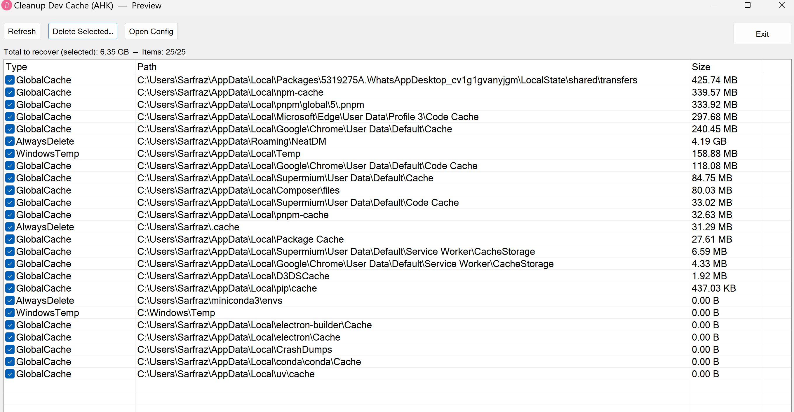

# DevCacheCleaner

`DevCacheCleaner.ahk` is an AutoHotkey v2 script designed to help you clean development-related cache files and directories on your Windows 11 system. It provides a graphical user interface (GUI) for a safe and controlled cleanup process.

## Features:

*   **GUI-Based Operation:** Easy-to-use interface for managing cache cleanup.
*   **Preview Before Deletion:** Displays a preview of all identified cache paths and their sizes before any files are removed, allowing you to review and select items for deletion.
*   **User Confirmation:** Requires explicit user confirmation before proceeding with any deletions, preventing accidental data loss.
*   **Configurable Cleanup:** Utilizes `cleanup.ini` for flexible configuration, including:
    *   Defining **root paths** to scan for development projects.
    *   Specifying **patterns** for common cache directories (e.g., `node_modules/.cache`, `__pycache__`, `.gradle/caches`).
    *   Setting **exclusions** to prevent specific files or directories from being deleted.
    *   Optionally including **Windows temporary files** and **global application caches** in the cleanup process.
*   **Logging:** Maintains a `cleanup.log` file to record all cleanup actions.
*   **Preservation List:** Allows you to define a list of file names in `cleanup.ini` that should *never* be deleted, even if they are found within a cache directory.

## How it Works:

The script scans the specified root directories for development projects, identifies cache-like directories based on configured patterns, and presents them in a list. You can then select which items to delete. It also offers the option to clean common Windows temporary folders and global caches.

## Configuration:

The behavior of the script is controlled by the `cleanup.ini` file, located in the same directory as the script. This file allows you to customize:

*   `[General]` settings like `ConfirmBeforeDelete`, `MaxDepth`, `IncludeWindowsCleanup`, `IncludeGlobalCaches`, and the `LogFile` path.
*   `[Roots]` where you define the base directories for your projects.
*   `[AlwaysDelete]` for paths that should always be considered for deletion.
*   `[Markers]` for files that indicate a project directory (e.g., `.git`, `package.json`).
*   `[Patterns]` for the actual cache directory names to look for.
*   `[Excludes]` for directories or exact paths to skip during cleanup.
*   `[WindowsCleanup]` for Windows-specific temporary directories.
*   `[GlobalCaches]` for common global application caches.
*   `[Preserve]` for file names that should never be deleted.

This script provides a powerful yet safe way to manage and clean up accumulated development caches, helping to free up disk space and maintain a tidy development environment.